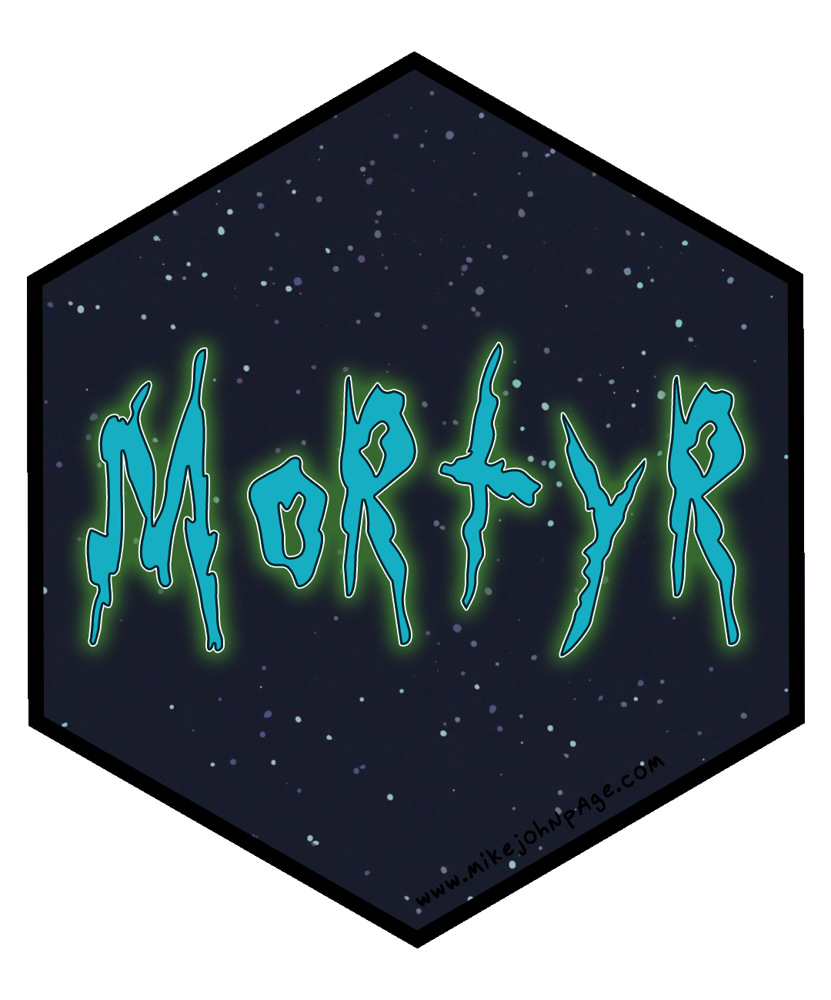

<!-- README.md is generated from README.Rmd. Please edit that file -->

```{r, include = FALSE}
knitr::opts_chunk$set(
  collapse = TRUE,
  comment = "#>",
  fig.path = "man/figures/README-",
  out.width = "100%"
)
options(tibble.print_min = 5, tibble.print_max = 5, tibble.max_extra_cols = 0)
```

# mortyr </a>

<!-- badges: start -->
[](http://www.repostatus.org/#active)
[](https://travis-ci.org/MikeJohnPage/mortyr)
<!-- badges: end -->

## Overview

mortyr is an R wrapper to the [The Rick and Morty API](https://rickandmortyapi.com/)
and the most rickdiculous package in the R-verse. Use it to return information
about your favourite characters, locations, and episodes from the show.

## Installation

You can install the development version from GitHub with:

``` r
# install.packages("devtools")
devtools::install_github("MikeJohnPage/mortyr")
```
## Usage

</a> _"Aw geez, Rick, how do I use this package?"_

</a> _"It's simple Morty, you idiot. First, take the dinglebop, and then smooth it out with a bunch of schleem. Then, push it through the grumbo, making sure to cut out the fleeb. Make sure the blamfs rub against the chumbles and that the ploobis and grumbo are shaved away. Then you will be left with a regular old plumbus."_  

</a> _"I-I-I don't know Rick, are you sure about that?"_

</a> _"Yes of course I'm sure Morty. That's the difference between you and me: I'm certain, and you're a walking burlap sack filled with turds."_

</a> _"So what you are saying is that R is such a great environment to wrangle data that the mortyr package abstracts away the API into just three functions: one that returns all characters, one that returns all locations, and one that returns all episodes, from each respective API endpoint?"_

</a> _"Yes, obviously Morty. You're as dumb as they come. Why create overly-complicated R functions with a higher cognitive load when mortyr could do the hard work of returning and combining data from paginated API reponses? It is not like we are dealing with big data here Morty, R is clearly the better environment to explore the API data. Now flip off all these R users that think this package is pointless Morty. I told them it means peace among worlds. How hilarious is that?"_

```{r}
library(mortyr)

get_characters()

get_locations()

get_episodes()
```

## Rate limit

The Rick and Morty API is an open API, so no authentication is required for use. Nonetheless, to prevent malicious usage of the API there is a limit on the number of requests a given IP address can make. This limit is 10000 requests per day. If you happen to hit the limit you'll receive a 429 status (Too Many Requests) on all your requests during a period of 12 hours.

## Getting help

If you encounter a clear bug, please file a minimal reproducible example in [issues](https://github.com/MikeJohnPage/mortyr/issues).
