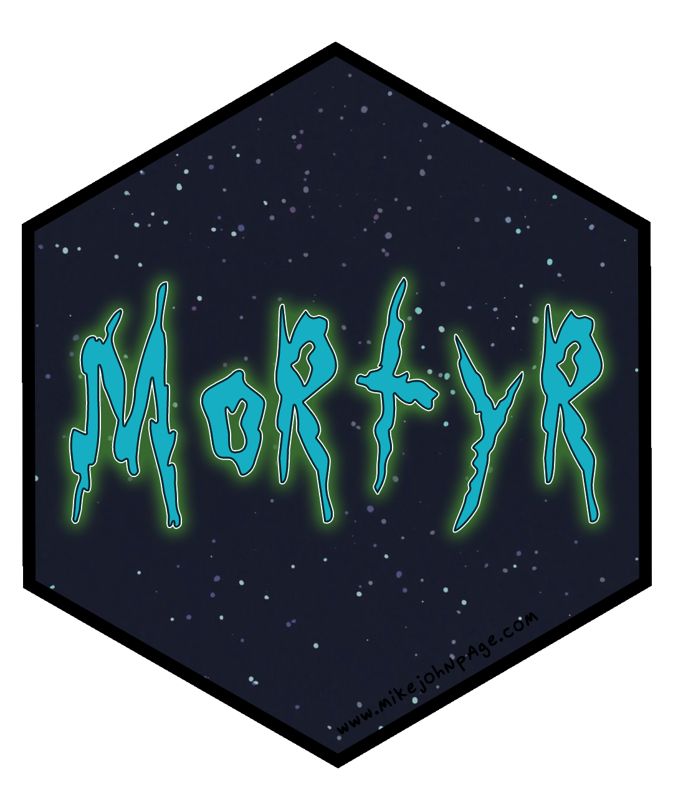

<!-- README.md is generated from README.Rmd. Please edit that file -->

# mortyr </a>

<!-- badges: start -->

[](http://www.repostatus.org/#active)
[](https://travis-ci.org/MikeJohnPage/mortyr)
<!-- badges: end -->

## Overview

mortyr is an R wrapper to the [The Rick and Morty
API](https://rickandmortyapi.com/) and the most rickdiculous package in
the R-verse. Use it to return information about your favourite
characters, locations, and episodes from the show.

## Installation

You can install the released version of mortyr from CRAN:

``` r
install.packages("mortyr")
```

Or install the development version from GitHub with:

``` r
# install.packages("devtools")
devtools::install_github("MikeJohnPage/mortyr")
```

## Usage

</a> *“Aw
geez, Rick, how do I use this package?”*

</a> *“It’s
simple Morty, you idiot. First, take the dinglebop, and then smooth it
out with a bunch of schleem. Then, push it through the grumbo, making
sure to cut out the fleeb. Make sure the blamfs rub against the chumbles
and that the ploobis and grumbo are shaved away. Then you will be left
with a regular old plumbus.”*

</a> *“I-I-I
don’t know Rick, are you sure about that?”*

</a> *“Yes of
course I’m sure Morty. That’s the difference between you and me: I’m
certain, and you’re a walking burlap sack filled with turds.”*

</a> *“So
what you are saying is that R is such a great environment to wrangle
data that the mortyr package abstracts away the API into just three
functions: one that returns all characters, one that returns all
locations, and one that returns all episodes, from each respective API
endpoint?”*

</a> *“Yes,
obviously Morty. You’re as dumb as they come. Why create
overly-complicated R functions with a higher cognitive load when mortyr
could do the hard work of returning and combining data from paginated
API responses? It is not like we are dealing with big data here Morty.
Now flip off all these R users that think this package is pointless
Morty. I told them it means peace among worlds. How hilarious is that?”*

``` r
library(mortyr)

get_characters()
#> # A tibble: 671 x 14
#>      id name  status species type  gender image episode url   created
#>   <int> <chr> <chr>  <chr>   <chr> <chr>  <chr> <list>  <chr> <chr>  
#> 1     1 Rick… Alive  Human   ""    Male   http… <chr [… http… 2017-1…
#> 2     2 Mort… Alive  Human   ""    Male   http… <chr [… http… 2017-1…
#> 3     3 Summ… Alive  Human   ""    Female http… <chr [… http… 2017-1…
#> 4     4 Beth… Alive  Human   ""    Female http… <chr [… http… 2017-1…
#> 5     5 Jerr… Alive  Human   ""    Male   http… <chr [… http… 2017-1…
#> # … with 666 more rows, and 4 more variables

get_locations()
#> # A tibble: 108 x 7
#>      id name      type     dimension   residents  url               created     
#>   <int> <chr>     <chr>    <chr>       <list>     <chr>             <chr>       
#> 1     1 Earth (C… Planet   Dimension … <chr [27]> https://rickandm… 2017-11-10T…
#> 2     2 Abadango  Cluster  unknown     <chr [1]>  https://rickandm… 2017-11-10T…
#> 3     3 Citadel … Space s… unknown     <chr [91]> https://rickandm… 2017-11-10T…
#> 4     4 Worldend… Planet   unknown     <chr [9]>  https://rickandm… 2017-11-10T…
#> 5     5 Anatomy … Microve… Dimension … <chr [11]> https://rickandm… 2017-11-10T…
#> # … with 103 more rows

get_episodes()
#> # A tibble: 41 x 7
#>      id name        air_date    episode characters url              created     
#>   <int> <chr>       <chr>       <chr>   <list>     <chr>            <chr>       
#> 1     1 Pilot       December 2… S01E01  <chr [19]> https://rickand… 2017-11-10T…
#> 2     2 Lawnmower … December 9… S01E02  <chr [19]> https://rickand… 2017-11-10T…
#> 3     3 Anatomy Pa… December 1… S01E03  <chr [24]> https://rickand… 2017-11-10T…
#> 4     4 M. Night S… January 13… S01E04  <chr [13]> https://rickand… 2017-11-10T…
#> 5     5 Meeseeks a… January 20… S01E05  <chr [20]> https://rickand… 2017-11-10T…
#> # … with 36 more rows
```

## Rate limit

The Rick and Morty API is an open API, no authentication is required for
use. Nonetheless, to prevent malicious usage of the API there is a limit
on the number of requests a given IP address can make. This limit is
10000 requests per day. If you happen to hit the limit you’ll receive a
429 status (Too Many Requests) on all your requests during a period of
12 hours.

## Getting help

If you encounter a clear bug, please file a minimal reproducible example
in [issues](https://github.com/MikeJohnPage/mortyr/issues).

</a>
*“SHOW ME WHAT YOU GOT.”*
